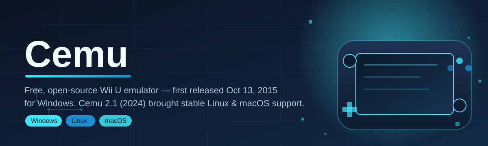
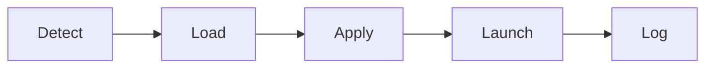

# wiiu-emulator-companion 🎮🧩

  

*A friendly companion toolkit that helps you configure, launch, and get the most out of your Wii U emulation setup.*

  

## 📖 About / Preview

`wiiu-emulator-companion` is a community-built companion app for people running a Wii U emulator on their desktop. It doesn't replace the emulator core itself — instead, it wraps around your existing setup to make configuration, graphics-pack management, and day-to-day launching dramatically less tedious.

For context: the Wii U emulation scene traces back to a closed-source Windows project first released in October 2015, built by two developers who kept iterating on it for nearly a decade. It went fully open-source and picked up official Linux and macOS support in mid-2024, and along the way it became famous for booting a certain beloved open-world Zelda title within hours of that game's original release. That moment put Wii U emulation on the map for a lot of people, and this companion project exists because of the wonderful community that grew out of it.

This repository is aimed at two groups: newcomers who just want a friendlier on-ramp into Wii U emulation without memorizing folder structures, and tinkerers who want scriptable, repeatable environments for testing builds, graphics packs, and controller profiles. Whether you're chasing buttery-smooth frame pacing in an open-world adventure or just want your save files organized sanely, this tool tries to stay out of your way.

---

## ✨ The Feature That Gets Everyone Talking

Before we get into the full list — the headline feature is **one-click profile switching**. Swap between graphics packs, controller mappings, and resolution presets for different games in a single click, without ever touching a config file by hand. Contributors tell us this is the reason they stopped dreading "setup day" for a new title.

> [!TIP]
> Pair a profile with a specific game's save folder and the companion will remember it forever — no more re-configuring the same title twice.

### Before / After

| | Before `wiiu-emulator-companion` | After `wiiu-emulator-companion` |
|---|---|---|
| **Setting up a new game** | Manually editing `.ini` files, guessing at resolution values | Pick a profile template, click apply, done |
| **Graphics packs** | Downloading and dropping files into nested folders by hand | Browsable pack manager with enable/disable toggles |
| **Controller mapping** | Re-mapping every session for every game | Saved per-title mapping profiles |
| **Save management** | Loose files scattered across directories | Organized, backed-up, per-title save vaults |
| **Troubleshooting** | Digging through forum threads | Built-in log viewer with plain-English hints |
| **Onboarding a friend** | A 45-minute phone call | A shared exported profile file |

---

## 🚀 What Else Is In The Box

- **Profile Vault** — save, export, and share complete emulator configurations, including graphics packs and input maps, as a single portable file.
- **Compatibility Notes Panel** — a searchable, community-sourced notebook of which titles run smoothly and which quirks to expect, so you spend less time guessing.
- **Graphics Pack Curator** — browse, enable, and version-check enhancement packs without wading through raw folder trees.
- **Controller Auto-Detect** — plugs and unplugs gracefully; recognized pads get mapped to sane Wii U-style defaults automatically.
- **Save Vault & Backups** — automatic snapshotting of save data before risky updates, so a bad graphics pack never costs you your progress.
- **Session Log Reader** — turns dense debug output into short, human-readable status lines ("shader cache building," "controller reconnected," etc).
- **Launch Presets** — bundle resolution, audio, and pack selections into a preset you can fire off with one click per game.
- **Theming Engine** — light, dark, and a few community-submitted color schemes, because staring at gray dialogs all day is nobody's idea of fun.

> [!NOTE]
> This companion tool is built around, and depends on, having a working Wii U emulator already installed on your machine. It's a workflow layer, not a replacement core.

---

## 🧭 How To Get Started

1. **Visit the landing page** using the download button above or below — that's the only place official builds are published.
2. **Download the latest release** for Windows.
3. **Run the installer or portable executable** — no separate runtime or dependency installation required.
4. **Point it at your existing emulator folder** on first launch, then start building your first profile.

> [!IMPORTANT]
> Always download from the official landing page linked in this README. Third-party mirrors are not maintained by this project and may be outdated or altered.

---

## 🖥️ System Requirements

| Component | Minimum | Recommended |
|---|---|---|
| **OS** | Windows 10 (64-bit) | Windows 11 (64-bit) |
| **RAM** | 4 GB | 8 GB or more |
| **Disk Space** | 500 MB free (companion only) | 2 GB+ free (companion + profiles + packs) |

> [!WARNING]
> These figures cover the companion app itself. The underlying Wii U emulator and individual games have their own, generally heavier, hardware needs — check each title's compatibility notes before assuming smooth performance.

---

## ⚙️ How It Works

The companion sits as a thin, friendly layer between you and your emulator installation:

1. **Detect** your existing emulator installation and its configuration files.
2. **Load** any saved profiles, graphics packs, and controller maps you've created.
3. **Apply** your chosen preset to the emulator's config before launch.
4. **Launch** the emulator process with everything already in place.
5. **Log** the session in plain language so troubleshooting later is painless.

---

## 🩹 Troubleshooting

<strong>The companion says it can't find my emulator installation.</strong>

Point it manually at the emulator's install folder in Settings → Emulator Path. Portable installs in unusual directories sometimes aren't auto-detected.

<strong>A graphics pack I enabled doesn't seem to do anything.</strong>

Some packs require a specific game version or region. Check the Compatibility Notes Panel for that title before assuming the pack is broken.

<strong>My controller isn't being recognized.</strong>

Try unplugging and replugging while the companion is open — Controller Auto-Detect listens for hot-plug events. If it still fails, add a manual mapping profile instead.

<strong>Performance is choppy in a specific game.</strong>

Shader cache building on first launch is normal and temporary. If stutter persists afterward, check whether a lighter resolution preset improves things.

<strong>I restored a save backup but it's not showing in-game.</strong>

Make sure the save vault entry matches the exact title ID your emulator expects — restoring to the wrong region/ID slot is the most common cause.

<strong>Can I run this alongside other emulation tools?</strong>

Yes — the companion only reads/writes config it owns and doesn't lock exclusive access to your emulator folder.

---

## 🎨 UI / UX Details

- **Themes**: Light, Dark, and community palettes, switchable instantly from Settings.
- **Keyboard shortcuts**:
  - `Ctrl+N` — New profile
  - `Ctrl+S` — Save current profile
  - `Ctrl+L` — Launch selected profile
  - `Ctrl+,` — Open Settings
  - `F1` — Open Compatibility Notes for the selected title
- **Settings panel** groups options by Emulator Path, Profiles, Graphics Packs, and Logging — nothing buried three menus deep.

  

---

## 🤝 Contributing & Community

We love good-first-issues here. If you're new to open source, this is a genuinely welcoming place to start:

> [!TIP]
> Look for issues tagged `good-first-issue` — they're scoped small on purpose, and a maintainer will usually respond within a day or two.

- Fork the repo and open a pull request — small, focused changes are easier to review and merge.
- Found a compatibility quirk for a game? Add it to the Compatibility Notes Panel data and submit a PR.
- Discussion, feature ideas, and troubleshooting help all live in the Issues and Discussions tabs.
- Please be kind — this project only works because contributors keep showing up for each other.

---

## 📜 License

Released under the [MIT License](LICENSE), 2026.

---

## ⚠️ Disclaimer

This project is an independent, community-built companion tool and is not affiliated with, endorsed by, or associated with Nintendo. Wii U emulation exists in a legal gray area regarding game software; you are responsible for only using content you legally own. This tool does not distribute copyrighted game files, firmware, or keys of any kind.

